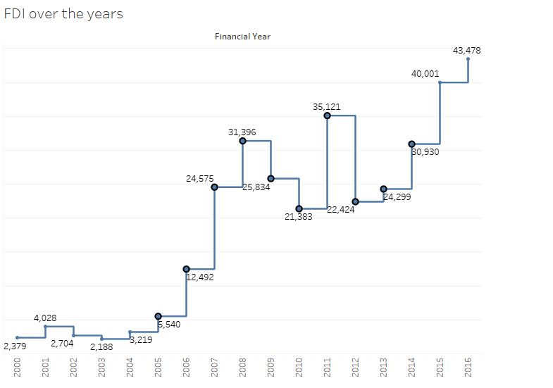
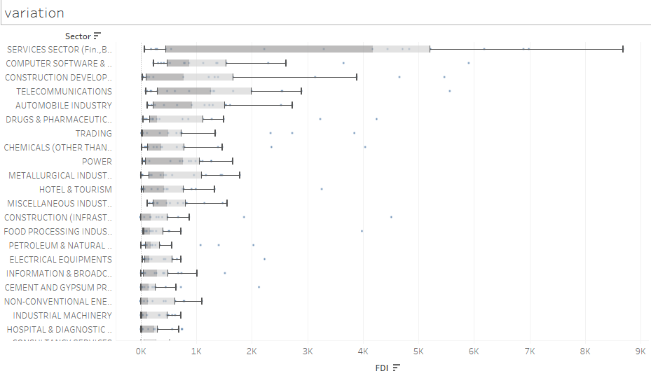
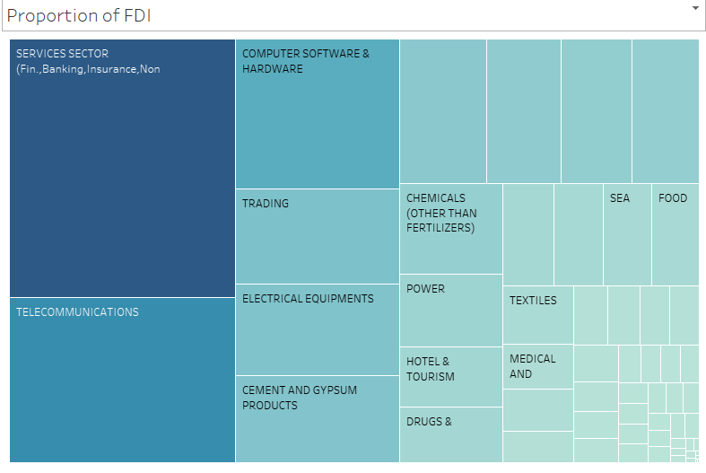
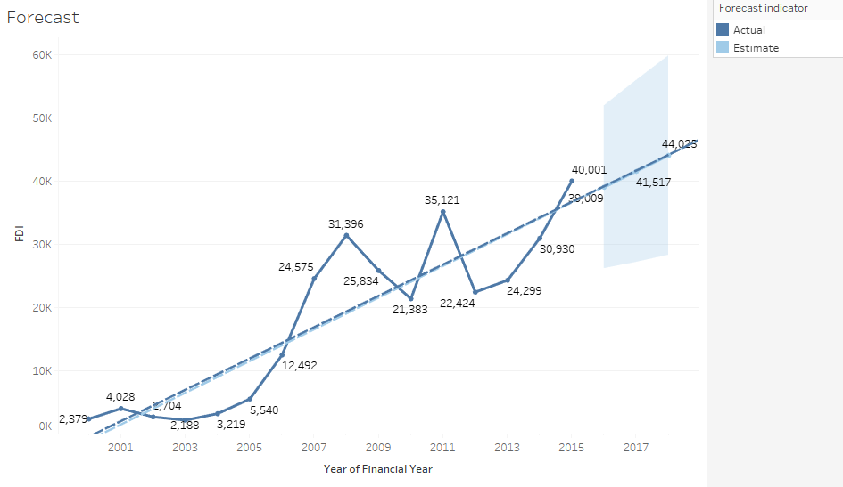

# Tableau-Visualizations

## Data Analysis using Tableau

### Foreign direct investment
I have shown some Tableau Dashboard using datasets. The dataset link is also given. You can also find each of the Tableau Workbook in the folder Workbooks. Please feel free to check out the below images. 

 
 
 
 

### About
Foreign direct investment in a business by an investor from another country for which the foreign investor has control over the company purchased.  in India is a major monetary source for economic development in India. Foreign companies invest directly in many sectors to take benefits of cheaper wages and changing business environment of India. 

### Dataset
The dataset contained Foreign direct investment in India for the last 17 years from 2000-01 to 2016-17. It contains sector and Financial year-wise data of FDI in India. I have made a total of two dashboards. The main reason to analyze the data was to observe how the FDI has changed over many years. We can easily observe the change in FDI by observing the step chart that FDI has changed a lot after Narendra Modi's arrival. More information is on the Tableau Public Link provided below.

workbook name : FDI in India Dashboard 
Dataset : [FDI in India](https://www.kaggle.com/rajanand/fdi-in-india)

### Summary:
Now there when analyzing the FDI over many years in India many important questions need to be answered which determines the FDI trend and if it is increasing or decreasing under the new government. Now if we observe from the max table we can see that the service sector got the most funding in the year 2016. If we properly observe the step chart then we can see that from 2008 the FDI dropped low till 2010 and then increased in 2011 and then kept decreasing again and then kept increasing.
The main reason behind this trend can be that elections were scheduled in 2009 which can be a factor for FDI going down as investors may be worried about what government will be there and what new policies will be. Another reason can be that from 2007 to 2010 in Feb there was a Subprime mortgage crisis in the USA  which can also be a reason and then jumped to 2011 the companies recovered and
received many packages. In 2005 the FDI suddenly increased to double to 2006.
Grouping form based on value is done to show that FDI over or equal 1500 for which the sectors are marked blue and red if it is below 1500.
I have now tried to find out the highest growth of FDI in top-performing sectors and found out that Glue and Gelatin had the highest growth in 2016 followed by cement and gypsum Products while the low growth sectors were also there in many sectors. I could get important statistical information from the variation chart that is the service sector had the most variation where lower whisker is 71 and the upper whisker is 8684. Comparing 3 sectors computer software, construction dev and telecommunication reveals that we can easily see that the median value in telecommunication is higher. So on average, the telecommunication sector has got more FDI compared to two computer software and construction dev even though the two are showing maximum data points.

We can observe from the chart the proportion of each sector in FDI. In 2013 food processing was the one with the highest FDI
but then from 2014 to 2016, the service sector remains with the highest FDI. Observing forecast chart we can see the forecast for the year 2017 and 2018 and we can easily see that in 2016 FDI drops according to forecast but that is not the case if we compare with the step line chart. and in 2017 and 2018 the FDI increases also
the upper and lower bound of the forecast is also shown. FDI formula is given and the R squared value is 79 meaning we can depend on that value and P-value is .0001 so if the value is below .005 then the model is accepted.

You can view final version of  two Foreign direct investment dashboards by clicking on link below: 
[Dashboard 1](https://public.tableau.com/profile/smit106059#!/vizhome/ForeigndirectinvestmentDashboard1/Dashboard1) 
[Dashboard 2](https://public.tableau.com/profile/smit106059#!/vizhome/ForeigndirectinvestmentDashboard2/Dashboard2)

## References

    Wikipedia
    Udacity Tableau Course.
    Tableau Tutorials.
    A lot of googling to figure out how to do stuff.

